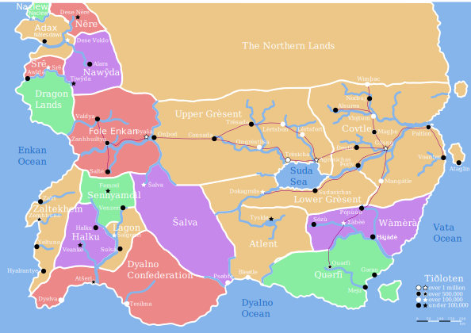

I've created an updated map of Tiðloten! I think this one's less saturated colour scheme makes it look much better. I've also chosen a more interesting font than Arial for the labels. And I've filled it in using just four colours. A quick note: the large orange block represents the Wiþi Empire, which is one political unit, but big enough that its biggest subdivisions are included in the map.

