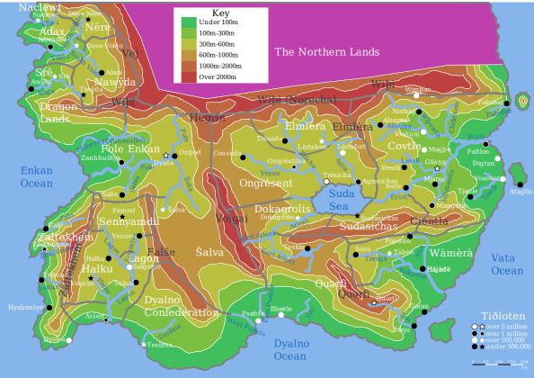

It's been a while since I made a map post, so I wanted to add my new map - a physical map of Tiðloten, showing elevation and naming all rivers and mountain ranges in the local languages. Please note that the political boundaries are slightly different as the year of this map is 2112, not 2047. The Northern Lands is magenta as elevations and rivers there are not included on this version of the map - I'll post an updated version with the physical details of the Northern Lands as well at some point in the future.

